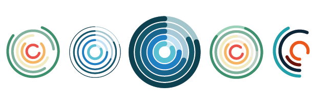
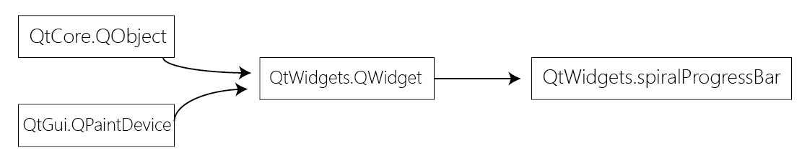
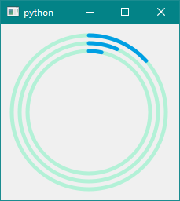
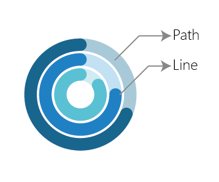
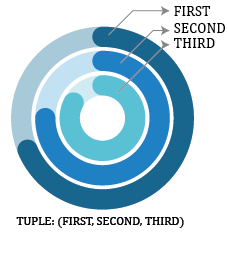

# Class: SpiralProgressBar

SpiralProgressBar Class provides a fully customizable (Max. 6) Concentric Round ProgressBar. *See below*.

  

  

# Synopsis

## Functions

* [def setMaximumSize(width, height)](#pyside2qtwidgtesspiralprogressbarsetmaximumsizewidth-height)
* [def setMinimumSize(width, height)](#pyside2qtwidgtesspiralprogressbarsetminimumsizewidth-height)
* [def setNumberOfProgressBar(int)](#pyside2qtwidgtesspiralprogressbarsetNumberOfProgressBarint)
* [def setValue(value tuple)](#pyside2qtwidgtesspiralprogressbarsetvaluevalue-tuple)
* [def setMaximumValue(max tuple)](#pyside2qtwidgtesspiralprogressbarsetmaximummax-tuple)
* [def setMinimum(min tuple)](#pyside2qtwidgtesspiralprogressbarsetminimummin-tuple)
* [def setRange(min tuple, max tuple)](#pyside2qtwidgtesspiralprogressbarsetrangemin-tuple-max-tuple)
* [def setGap(int)](#pyside2qtwidgtesspiralprogressbarsetgapint)
* [def setInitialPos(position)](#pyside2qtwidgtesspiralprogressbarsetinitialposposition-tuple)
* [def setGeometry(X, Y)](#pyside2qtwidgtesspiralprogressbarsetgeometryx-y)
* [def setDirection(dir)](#pyside2qtwidgtesspiralprogressbarsetdirectiondir-tuple)
* [def reset()](#pyside2qtwidgtesspiralprogressbarreset)
* [def variableWidth(bool)](#pyside2qtwidgtesspiralprogressbarvariablewidthbool)
* [def widthIncrement(int)](#pyside2qtwidgtesspiralprogressbarwidthincrementint)
* [def setLineWidth(int)](#pyside2qtwidgtesspiralprogressbarlinewidthint)
* [def setLineColor(color tuple)](#pyside2qtwidgtesspiralprogressbarlinecolorcolor-tuple)
* [def setLineStyle(style tuple)](#pyside2qtwidgtesspiralprogressbarlinestylestyle-tuple)
* [def setLineCap(cap tuple)](#pyside2qtwidgtesspiralprogressbarlinecapcap-tuple)
* [def setPathHidden(bool)](#pyside2qtwidgtesspiralprogressbarsetpathhiddenbool)
* [def setPathColor(color tuple)](#pyside2qtwidgtesspiralprogressbarpathcolorcolor-tuple)

## Detailed Description

  

A progress bar is used to give the user an indication of the progress of an operation and to reassure them that the application is still running. A Spiral Progress bar does the same function with the progress indicated moves in a circular pattern.

A Spiral Progress as the name suggests is ***not* Spiral** but is made of multiple concentric Round Progress Bar, with the ability to customize its width, style, cap, and the progress value individually for each  concentric Round Progress Bar. Along with it, the class provides the ability to make the concentric round progress bar of different sizes inside the same widget.

Spiral Progress Bar uses the concept of steps, You set it up by specifying the minimum and maximum possible step values (for each concentric round progress bar individually), and it will display the percentage of steps that have been completed when you later give it the current step value(for each concentric round progress bar individually). The percentage is calculated by dividing the progress (`value()` - `minimum`)/(`maximum` - `minimum`)

You can specify the minimum and the maximum number of steps with `setMinimum()` and `setMaximum`() The current number of steps is set with `setValue()`. Each of this function takes a tuple as input containing the respective values *(e.g.: spiral progress bar with default no. of round progress bars of 3, minimum as (0, 0, 0), maximum as (100, 100, 100), and value as (12, 75, 86), and so the spiral progress bar displays the following percentage 12%, 75%, 86% from outward to inwards respectively)* in order. The progress bar can be rewound to the beginning with `reset()`

## Naming Convention

As the PySide2/PyQt5/PySide6/PyQt6 library is so big and most of the common name is occupied by the various methods in the class, I was limited to use a *custom name* for the methods in the SpiralProgressBar class, so I decided to go for a **prefix at the beginning** of each method name so that it is easy to remember. So to modify the spiral progress bar style, text, color, etc each time, the method name has to be called with a **prefix of ``**. So the idea remains the same, eg: that if you want to set the maximum value of the progress bar, call the method `setMaximumValue()` and pass the maximum tuple as an argument. This idea applies to all other methods used in this class.

The Spiral Progress Bar has **3 Parts: Line, Path, Number of Progress Bar**, *see below*

  

Spiral progress bar contains many elements, which can be customized according to the users need, since the spiral progress bar contains multiple concentric circles, for one to control each circle independently, an efficient method to do such a thing is by passing a tuple where the elements of the tuple correspond to the customizable part of the spiral progress bar. The order of arrangement of the element in the tuple is on par with the order of concentric circle i.e. first element in the tuple always corresponds to the outer concentric circle and the last element in the tuple points to the innermost concentric circle. 

  

Examples of some of the function is displayed below:

* `setValue((58, 65, 25))`: Set the value of the progress bar to 58%, 65%, 25% for the outer most, middle and the innermost circle respectively
* `setLineColor((QColor(0, 255, 125), QColor(255, 0, 125), QColor(125, 125, 125)))`: Set a custom color to each circle progress bar with the following order: (0, 255, 125): Outermost line color, (255, 0, 125): Middle most circle and (125, 125, 125): Innermost circle.
* `setLineStyle(('DotLine', 'DashLine', 'SolidLine'))`: Here the tuple contains a string representing the line style. The idea behind tuple is also the same.

## Default Settings of Spiral Progress Bar

Whenever you create a spiral progress class object you will be presented with a default spiral progress bar with the following properties:

* **Number of Progress Bars:** 3
* **Size:** Dynamic i.e. expands with the change in size of the window/frame
* **Range:** 0 to 100
* **Value:** (36, 24, 12)
* **Start Position:** North
* **Direction of Progress:** Clockwise
* **Line Width:** 5px
* **Gap Between Progress Bar:** 10px
* **Line Color:** ((0, 159, 227), (0, 159, 227), (0, 159, 227))
* **Line Style:** (SolidLine, SolidLine, SolidLine)
* **Line Cap:** (RoundCap, RoundCap, RoundCap)
* **Variable Width:** False
* **Path Hidden:** False
* **Path Width:** Same as the Line Width
* **Path Color:** ((179, 241, 215), (179, 241, 215), (179, 241, 215))

## Class SpiralProgressBar()

### ***PySide2.QtWidgtes.SpiralProgressBar.setMaximumSize(width, height)***

**Parameters**: width, height in `int`

Set the maximum size of the progress bar by passing width and height as argument respectively. The maximum size correlates directly to the outermost concentric progress bar. By fixing the maximum size the user is limiting the size of the progress bar to the value entered, and when the window size decreases much lower than the user entered widget maximum the spiral progress bar automatically reduces the size (until the user manually specifies the minimum size of the widget).

***

### ***PySide2.QtWidgtes.SpiralProgressBar.setMinimumSize(width, height)***

**Parameters** : width, height in `int`

Set the minimum size of the progress bar by passing width and height as argument respectively. By fixing the minimum size the user is limiting the minimum size of the progress bar to the value entered, and when the window size increases spiral progress bar automatically increases in size.

***

### ***PySide2.QtWidgtes.SpiralProgressBar.setNumberOfProgressBar(int)***

**Parameters**:  Number of Concentric Progress Bar in `int`

By default, the number of progress bar in the spiral progress bar is 3 but this can be increased by using this function. In this version, the maximum number of the progress bar in a single spiral progress bar is 6.

See: [Example](https://khamisikibet.github.io/PySideExtn/pages/examples/spbExamples#3-initial-position)

***

### ***PySide2.QtWidgtes.SpiralProgressBar.setValue(value tuple)***

**Parameters**: Value in `tuple`

As each value of the progress bar needed to be controlled individually for maximum customizability, a simple approach is to pass the value of the whole spiral progress bar as a tuple, where the elements order matters, i.e. the first element in the tuple controls the outermost circle of the progress bar and the last element in the progress bar controls the innermost circle of the progress bar.(Refer to the above Naming Convention Section for more clarity).

See: [Example](https://khamisikibet.github.io/PySideExtn/pages/examples/spbExamples#2-maximum-minimum-and-range)

***

### ***PySide2.QtWidgtes.SpiralProgressBar.setMaximumValue(max tuple)***

**Parameters**: Maximum Value as a `tuple`

A function to set the maximum value of the progress bar. By default, it is set to 100. The user can individually customize the maximum for each circle in the progress bar. The function takes a tuple as an argument with elements corresponds to the maximum of each circle of the progress bar. Example:
`setMaximumValue((100, 200, 300))` this makes the maximum value of the outermost progress bar to 100, middle progress  bar to 200 and innermost progress bar to 300.

See: [Example](https://khamisikibet.github.io/PySideExtn/pages/examples/spbExamples#2-maximum-minimum-and-range)

***

### ***PySide2.QtWidgtes.SpiralProgressBar.setMinimumValue(min tuple)***

**Parameters**: Minimum Value as a `tuple`

A function to set the minimum value of the progress bar. By default, the minimum value is 0 for all three circles. As same as setting the maximum given above the minimum also takes a tuple of minimum values of each concentric progress bar.

See: [Example](https://khamisikibet.github.io/PySideExtn/pages/examples/spbExamples#2-maximum-minimum-and-range)

***

### ***PySide2.QtWidgtes.SpiralProgressBar.setRange(min tuple, max tuple)***

**Parameters**: Maximum and Minimum passed as a `tuple`

This function makes life easy instead of using the maximum and minimum function(described above) this function achieves the same result in one go. The minimum and maximum are passed independently by different tuples. The format is similar to what is described.

See: [Example](https://khamisikibet.github.io/PySideExtn/pages/examples/spbExamples#2-maximum-minimum-and-range)

***

### ***PySide2.QtWidgtes.SpiralProgressBar.setGap(int)***

**Parameters**: Gap between the lines in `int`

Normally the gap between the lines is set to default 2*line width, but users can override this by using this function. This function accepts `int` corresponding to the pixels gap between two lines.

See: [Example](https://khamisikibet.github.io/PySideExtn/pages/examples/spbExamples#5-line-color-style-cap-path-color)

***

### ***PySide2.QtWidgtes.SpiralProgressBar.setInitialPos(position tuple)***

**Parameters**: Starting position of the Progress bar as tuple.

There are 4 starting positions users can use they are: `North`, `South`, `East`, and `West`. Each concentric circles can be individually positioned by passing the position as a tuple. Example:
`setInitialPos(('North', 'South', East))`:  See image Below

See [Example](https://khamisikibet.github.io/PySideExtn/pages/examples/spbExamples#3-initial-position)

  

***

### ***PySide2.QtWidgtes.SpiralProgressBar.setGeometry(x, y)***

**Parameters**: Position of the spiral progress bar: x and y in `int`

The geometry function can be effectively used in cases when the user wants to customize the position of the spiral progress bar in the window. The default is (0, 0). The position corresponds to the upper corner of a square drawn over the outer circle of the spiral progress bar. 

***

### ***PySide2.QtWidgtes.SpiralProgressBar.setDirection(dir tuple)***

**Parameters**: Direction as `tuple`

Two ways the progress bar can move: `Clockwise` and `AntiClockwise`. Each of the circular progress bars directions can be independently set, by passing the direction as an element of the tuple.The Order of element corresponds to the outer to the inner combination.

See: [Example](https://khamisikibet.github.io/PySideExtn/pages/examples/spbExamples#4-direction)

***

### ***PySide2.QtWidgtes.SpiralProgressBar.reset()***

**Parameters**: Nil

This function resets the spiral progress bar to a minimum value i.e. to 0%.

***

### ***PySide2.QtWidgtes.SpiralProgressBar.variableWidth(bool)***

**Parameters**: `bool`

The width of each line can be specified by the `setLineWidth()` function but this sets the width to all the line elements. This can be made to change by this function, where if `True` then the width increases going from outer to the inner circles. The increment is set to 1px increment as default. But this can be changed using the function `widthIncrement` see below. 

See: [Example](https://khamisikibet.github.io/PySideExtn/pages/examples/spbExamples#6-variable-width-and-width-increment)

***

### ***PySide2.QtWidgtes.SpiralProgressBar.widthIncrement(int)***

**Parameters**: Increment as `int`

The width increment is used in par with the `variableWidth()`, the default width increment of 1px is changed with `int` passed to the function. See the SpiralPorgressBar Example for more details.

See: [Example](https://khamisikibet.github.io/PySideExtn/pages/examples/spbExamples#6-variable-width-and-width-increment)

***

### ***PySide2.QtWidgtes.SpiralProgressBar.setLineWidth(int)***

**Parameters**: Width in `int`

Line width is 5px default, which can be changed to any size by using this function. It accepts an `int` in px. Remember the width specified applies to all the concentric circles in the spiral progress bar and also the path of the spiral progress bar. Also, the gap between the lines is defined as 2*line Width by default.

See: [Example](https://khamisikibet.github.io/PySideExtn/pages/examples/spbExamples#5-line-color-style-cap-path-color)

***

### ***PySide2.QtWidgtes.SpiralProgressBar.setLineColor(color tuple)***

**Parameters**: Color in `tuple`

The line color function resets the default line color of the progress bar to user-specified. It accepts a tuple with elements corresponding to the color of the line of each circles in the spiral progress bar. Each element should be in the format `QColor`. Remember this function changes the color of the line only, path color should be set differently.

See: [Example](https://khamisikibet.github.io/PySideExtn/pages/examples/spbExamples#5-line-color-style-cap-path-color)

***

### ***PySide2.QtWidgtes.SpiralProgressBar.setLineStyle(style tuple)***

**Parameters**: style string as an element of a `tuple`

A total of 3 different line style is defined in the class, which are: `SolidLine`, `DotLine`, and `DashLine`. Each circle in the spiral progress bar can have anindependent style. the tuple passed contains the string of the style name with the specific order. Example:
`setLineStyle(('SolidLine', 'DotLine', 'DashLine'))`

See: [Example](https://khamisikibet.github.io/PySideExtn/pages/examples/spbExamples#5-line-color-style-cap-path-color)

***

### ***PySide2.QtWidgtes.SpiralProgressBar.setLineCap(cap tuple)***

**Parameters**: Cap in `tuple`

Two different caps are available in this class: `RoundCap` and the `SquareCap`. the default is `RoundCap`. Users need to pass a tuple containing the cap name as a string to this function. Example:
`setLineCap(('RoundCap', 'SquareCap', 'RoundCap'))`

See: [Example](https://khamisikibet.github.io/PySideExtn/pages/examples/spbExamples#5-line-color-style-cap-path-color)

***

### ***PySide2.QtWidgtes.SpiralProgressBar.setPathHidden(bool)***

**Parameters**: `bool`

The path as default is visible, but users can override this and make the path hidden.

See: [Example](https://khamisikibet.github.io/PySideExtn/pages/examples/spbExamples#7-hidden-path)

***

### ***PySide2.QtWidgtes.SpiralProgressBar.setPathColor(color tuple)***

**Parameters**: Color in `tuple`

Path color is set independently from the line color. Path color is similar to line color and is passed as a tuple containing element in the form `(QColor)`.

***

Also See: [SpiralProgressBar Examples](https://khamisikibet.github.io/PySideExtn/pages/examples/spbExamples)